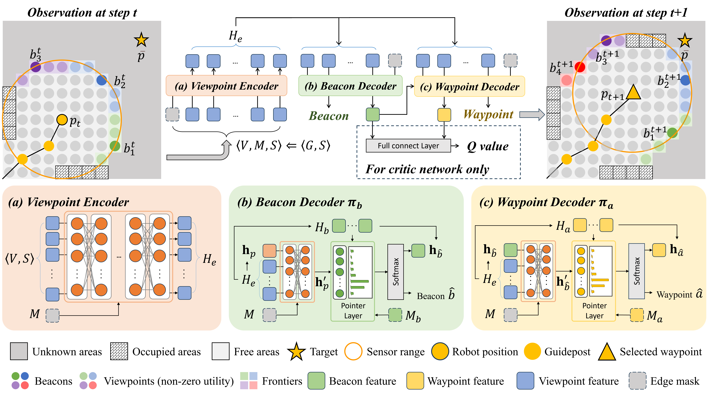

# HDPlanner_Exp_and_Nav
### Public code and datasets for <a href="https://ieeexplore.ieee.org/abstract/document/10767278">HDPlanner: Advancing Autonomous Deployments in Unknown Environments through Hierarchical Decision Networks</a>, which has been accepted by IEEE Robotics and Automation Letters (RA-L).

We propose a hierarchical planning approach for robot exploration and navigation in unknown environments, where our decision networks decompose long-term objectives into short-term task assignment (beacon) and informative path planning (waypoint).

<center class="half">
    
</center>

### Main Dependencies
* `python == 3.8.8`
* `pytorch == 1.8.1`
* `ray == 1.2.0`
* `scikit-image == 0.21.0`
* `scikit-learn == 1.3.0`
* `scipy == 1.10.1`
* `matplotlib == 3.6.2`
* `tensorboard == 2.11.0`

## Citation
If you find our work helpful or enlightening, feel free to cite our paper:
```
@ARTICLE{10767278,
  author={Liang, Jingsong and Cao, Yuhong and Ma, Yixiao and Zhao, Hanqi and Sartoretti, Guillaume},
  journal={IEEE Robotics and Automation Letters}, 
  title={HDPlanner: Advancing Autonomous Deployments in Unknown Environments Through Hierarchical Decision Networks}, 
  year={2025},
  volume={10},
  number={1},
  pages={256-263},
  doi={10.1109/LRA.2024.3506281}
}
```
## Authors
[Jingsong Liang](https://github.com/JingsongLiang),
[Yuhong Cao](https://github.com/caoyuhong001), 
[Yixiao Ma](https://github.com/Yixiao-M),
[Hanqi Zhao](), 
[Guillaume Sartoretti](https://github.com/gsartoretti)